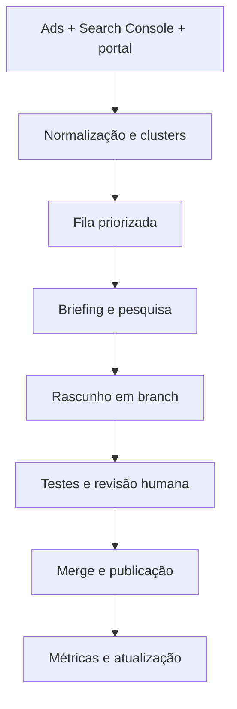

# Plano de SEO, SEO programático, GEO e blog

**Portal:** [portal.omontadordemoveis.com](https://portal.omontadordemoveis.com/)  
**Responsável editorial:** Willian Souza  
**Data-base do plano:** 12 de setembro de 2026  
**Ferramentas de execução:** GitHub, Vercel, OpenCode e Antigravity

## 1. Resultado que buscamos

Transformar o portal em uma fonte confiável e encontrável para duas audiências:

1. Pessoas procurando montadores de móveis em sua cidade, conduzidas para o perfil e o WhatsApp do profissional.
2. Montadores que querem captar clientes, conduzidos para cadastro no portal e, quando pertinente, para os serviços de site, landing page e gestão de anúncios do Willian.

O projeto não precisa virar um GetNinjas. Nesta etapa, o produto continua sendo um diretório com contato direto, acrescido de conteúdo útil, páginas locais bem construídas e uma operação editorial assistida por IA.

### Objetivos de negócio

- Aumentar tráfego orgânico não relacionado apenas ao nome da marca.
- Aumentar cliques em WhatsApp de profissionais.
- Aumentar cadastros de montadores.
- Gerar demanda qualificada para os serviços oferecidos aos profissionais.
- Construir uma marca e uma base de conhecimento citáveis por buscadores e assistentes de IA.

### Decisões já adotadas

- Manter contato direto com o profissional; não implementar intermediação, pagamento ou disputa de leads agora.
- Usar a stack atual do portal; não migrar para WordPress/Elementor.
- Lançar inicialmente cerca de 15 a 20 artigos realmente bons.
- Cada artigo será escrito do zero a partir de um briefing próprio, sem texto girado e sem molde repetitivo.
- A IA prepara pesquisa, briefing e texto; Willian revisa e aprova antes da publicação.
- Responder à pergunta principal já no primeiro parágrafo.
- Usar voz humana, experiência real e autoria de Willian Souza quando isso for verdadeiro e pertinente.
- Usar CTA contextual e discreto. Valores ficam nas páginas comerciais, não espalhados em todo artigo.
- Não criar centenas de páginas só pela combinação de cidade e serviço.
- Não tratar `llms.txt` como prioridade: o próprio Google informa que GEO parte dos mesmos fundamentos de SEO e não exige arquivo ou marcação especial para recursos generativos.

## 2. Diagnóstico inicial do portal

Esta foi uma inspeção externa inicial; o repositório ainda precisa ser auditado para localizar a causa de cada problema.

### P0 — corrigir antes de escalar conteúdo

| Problema observado | Risco | Correção esperada |
|---|---|---|
| A página `/recife` declara canonical para `/undefined` | Muito alto: consolidação e indexação erradas | Gerar canonical absoluto e autorreferente a partir da rota real |
| Páginas de cidade usam título e descrição genéricos da home | Alto: relevância local e CTR fracos | Metadados exclusivos por tipo de página e localidade |
| Resultados do Google aparentam associar conteúdos de Recife e Tijucas à URL raiz | Alto: provável efeito da canonicalização/metadados | Corrigir sinais e acompanhar reprocessamento no Search Console |
| `/blog` retorna 404 | Impede a estratégia editorial | Implementar índice, artigos, categorias úteis e feed/sitemap |
| Foi encontrado valor `null` em uma listagem regional | Qualidade, confiança e possíveis URLs inválidas | Validar dados e excluir registros incompletos da publicação |
| Texto `serviço profesionalescolhido` | Percepção de baixa qualidade | Corrigir texto e adicionar validação editorial |
| `WebSite/SearchAction` aponta para `?s=...`, mas não há busca textual equivalente comprovada | Marcação estruturada inconsistente | Remover até existir uma busca funcional compatível |
| `AggregateRating` e depoimentos precisam ser relacionados à entidade exata da página | Risco de dado enganoso e perda de rich result | Só marcar avaliações verdadeiras, visíveis e da mesma entidade |
| Expressão “segurança residencial garantida” | Promessa comercial possivelmente não sustentada | Remover ou explicar exatamente qual processo/garantia existe |
| Rastreamento analítico existe, mas os eventos de conversão não foram validados | Decisões sem dados confiáveis | Auditar GA4 e implementar eventos de funil |

### Sinais positivos atuais

- O portal já possui centenas de profissionais ativos — 618 na inspeção realizada.
- Existem páginas reais de cidade e perfis, não apenas uma ideia de produto.
- O Search Console já apresenta volume relevante de impressões e algumas consultas próximas da primeira página.
- Há dados de termos de pesquisa de campanhas reais, uma vantagem competitiva para escolher pautas e páginas por intenção comercial.
- A conversão pode acontecer pelo WhatsApp, sem exigir a construção imediata de um marketplace complexo.

## 3. Princípios de implementação

1. **Consertar antes de multiplicar.** Nenhum gerador de páginas ou artigos deve ampliar canonical, schema ou metadados defeituosos.
2. **Programa o sistema, não o texto vazio.** SEO programático serve para montar páginas úteis a partir de dados reais; não para publicar variações artificiais da mesma página.
3. **Uma intenção, uma página principal.** O mapa de palavras-chave deve evitar canibalização entre cidade, serviço, perfil e artigo.
4. **Automação com aprovação.** Inicialmente, toda publicação nasce em branch/PR e só entra em produção após revisão humana.
5. **Evidência antes de afirmação.** Sem bairros inventados, preços falsos, avaliações agregadas de outra entidade ou experiência que Willian não tenha.
6. **GEO é uma extensão de bom SEO.** Conteúdo claro, rastreável, original e citável; não uma coleção de truques para “enganar IA”.
7. **Dados de clientes são confidenciais.** Exportações de Ads devem ser agregadas e anonimizadas; nunca entram chaves, nomes de clientes ou dados pessoais no Git.

## 4. Arquitetura de documentos no repositório

Antes de alterar código, criar na raiz do repositório:

- `AGENTS.md` — comandos, arquitetura, regras do projeto e condições de aceite para os agentes.
- `PROJECT.md` — produto, audiências, conversões, proposta e limites comerciais.
- `SEO-GEO.md` — regras de URL, indexação, metadados, schema, links internos e GEO.
- `CONTENT-BLOG.md` — voz, pesquisa, briefing, campos editoriais, CTA e revisão.
- `IMPLEMENTATION.md` — fases, checklist e decisões ainda abertas.

Manter matéria-prima separada em `research/`, preferencialmente fora do Git quando contiver dados de contas:

- `research/raw/` — exportações originais, anonimizadas.
- `research/processed/` — clusters e relatórios derivados.
- `research/sources/` — lista de fontes públicas e data de consulta.

Os documentos da raiz são a regra oficial do projeto. NotebookLM pode servir como bancada de pesquisa, mas não deve ser a única fonte das decisões de código.

## 5. Plano de execução por fases

### Fase 0 — acesso, inventário e linha de base

**Entradas necessárias**

- Repositório GitHub exato do portal.
- Branch que publica em produção e configuração do projeto na Vercel.
- Scripts de build, teste, lint e checagem de tipos.
- Origem e modelo dos dados de profissionais, cidades, serviços e avaliações.
- Exportações anonimizadas de Search Console, Google Ads e Planejador de Palavras-chave.

**Trabalho**

- Abrir o repositório correto no Antigravity.
- Conferir `git status`, criar uma branch de trabalho e registrar o estado anterior.
- Executar build local sem alterar arquivos.
- Inventariar todas as rotas e classificá-las: home, estado, cidade, perfil, institucional, comercial, legal e erro.
- Rastrear o HTML gerado e registrar canonical, status, indexabilidade, título, descrição, H1, schema e links.
- Exportar a linha de base do Search Console e GA4 por tipo de página.
- Registrar páginas indexadas, excluídas e URLs submetidas no sitemap.

**Saída**

- Inventário completo de URLs.
- Lista priorizada de bugs P0/P1/P2.
- Linha de base que permita provar se as mudanças melhoraram ou pioraram o portal.

### Fase 1 — SEO técnico P0

**Implementação**

- Definir corretamente a origem pública do site na configuração do Astro.
- Gerar canonical absoluto a partir do pathname real e testá-lo em toda classe de rota.
- Definir uma política única para barras finais, letras minúsculas, acentos, parâmetros e redirecionamentos.
- Criar `title`, meta description, Open Graph e Twitter Card específicos para cada página.
- Garantir um H1 principal coerente por página.
- Corrigir URLs ou campos contendo `undefined`, `null` e dados vazios.
- Implementar uma página 404 real e impedir que erros retornem `200`.
- Revisar `robots.txt` e sitemap; o sitemap só deve listar URLs canônicas, indexáveis e com status `200`.
- Remover o `SearchAction` até haver uma busca textual real compatível.
- Validar todo JSON-LD; remover marcações que não correspondam ao conteúdo visível.
- Corrigir textos, promessas não comprovadas e erros de interface.
- Confirmar que links importantes são links HTML rastreáveis, não apenas eventos JavaScript.
- Auditar Core Web Vitals, acessibilidade, imagens, fontes, CSS e JavaScript enviados ao navegador.

**Testes automáticos obrigatórios**

- Build, lint, tipos e testes do repositório.
- Varredura no HTML gerado por `undefined`, `null`, canonical inválida e schema malformado.
- Verificação de canonical absoluta, única e autorreferente nas páginas indexáveis.
- Detecção de títulos, descrições e H1 ausentes ou duplicados.
- Validação de todos os objetos JSON-LD.
- Crawl de links quebrados e cadeias de redirecionamento.
- Comparação entre sitemap e rotas publicadas.
- Testes de regressão para, no mínimo: home, três cidades, três perfis, cadastro, uma página legal e 404.

**Condição de aceite**

Nenhuma URL indexável pode conter canonical `/undefined`, valores nulos visíveis, metadados genéricos indevidos ou schema que represente outra entidade.

### Fase 2 — inteligência de demanda

Os dados de anúncios devem orientar a pauta, mas não podem ser copiados mecanicamente para virar páginas.

**Exportações recomendadas**

| Fonte | Período | Campos mínimos |
|---|---|---|
| Google Ads — termos de pesquisa | Idealmente 12 a 24 meses | termo, campanha, grupo, correspondência, impressões, cliques, CTR, custo, conversões, taxa e CPA; localidade quando disponível |
| Planejador de Palavras-chave | Período mais amplo disponível | palavra, média mensal, tendência, concorrência, lances e segmentação geográfica usada |
| Search Console | Até 16 meses | consulta, página, país, dispositivo, data, cliques, impressões, CTR e posição |
| Base do portal | Estado atual | UF, cidade, quantidade de ativos, especialidades, avaliações válidas, última verificação e cobertura |

Não incluir nomes de anunciantes, e-mails, telefones, IDs externos, dados de cobrança ou qualquer informação pessoal desnecessária.

**Processamento**

- Normalizar acentos, plural, grafias, cidades e estados sem apagar a consulta original.
- Marcar intenção: contratação local, preço, tipo de montagem, problema/dúvida, marca de móvel, profissão/marketing.
- Unificar sinônimos e separar consultas que realmente pedem respostas diferentes.
- Cruzar demanda com posição orgânica, cobertura real do portal e valor comercial.
- Mapear cada cluster para uma única URL-alvo existente ou planejada.

**Artefatos derivados**

- `keywords-master.csv`
- `clusters.csv`
- `page-map.csv`
- `content-backlog.csv`
- `redirect-map.csv`
- `data-quality.csv`

**Pontuação sugerida de prioridade**

Usar uma escala transparente combinando:

- demanda observada;
- proximidade da primeira página;
- intenção de contratação;
- cobertura real de profissionais;
- lacuna de conteúdo;
- capacidade de produzir uma resposta original;
- risco de canibalização.

Volume sozinho não decide a prioridade.

### Fase 3 — arquitetura de informação e SEO programático

#### Decisão de URL antes da escala

As rotas atuais aparentam usar formatos curtos como `/recife`. Antes de publicar centenas de páginas, decidir entre:

1. preservar as URLs atuais, se forem inequívocas e já tiverem valor acumulado; ou
2. realizar uma única migração controlada para uma estrutura explícita, por exemplo `/montador-de-moveis/pe/recife/`, com mapa de redirecionamentos 301.

Há cidades brasileiras com o mesmo nome. Por isso, a decisão precisa considerar UF, histórico de indexação, links existentes e custo da migração. Não mudar URLs apenas por estética.

#### Tipos de página

- Hub nacional e hubs por estado, quando houver conteúdo e navegação úteis.
- Página de cidade com profissionais realmente disponíveis.
- Perfil individual de profissional.
- Página de serviço, se houver intenção independente e conteúdo suficiente.
- Artigo editorial.
- Página comercial para os serviços oferecidos aos montadores.

#### Regras para publicar uma página programática

Uma página só será indexável se tiver:

- intenção de busca identificável;
- dados válidos e atualizados;
- utilidade que não exista em outra página;
- profissionais ou uma resposta concreta para o usuário;
- título, H1, descrição e links internos próprios;
- conteúdo principal não produzido por simples troca de cidade em um parágrafo;
- lugar claro na navegação do portal.

Não criar o produto cartesiano `todas as cidades × todos os serviços`. Um limiar inicial, a validar com os dados, pode exigir ao menos três profissionais ativos e demanda observada para páginas cidade-serviço. O limiar final deve ser decidido depois da auditoria da base.

Para localidades sem oferta suficiente:

- não listar no sitemap;
- usar `noindex` em um estado transitório útil ou retornar 404 quando não existir página legítima;
- oferecer alternativas próximas apenas quando os dados geográficos forem confiáveis;
- nunca fingir cobertura.

#### Componentes úteis de uma página de cidade

- Resposta direta: disponibilidade e quantidade real de profissionais.
- Lista dos montadores com contato direto.
- Serviços e regiões atendidas baseados em dados.
- Explicação objetiva de como escolher e contratar.
- Avaliações verdadeiras associadas ao profissional correto.
- Data de atualização/verificação.
- Links para cidades próximas, serviços e guias relacionados.
- `BreadcrumbList` e `ItemList` coerentes com o conteúdo visível.

Não inserir “curiosidades locais”, bairros, preços ou prazos gerados sem fonte apenas para tornar a página aparentemente única.

#### Malha de links internos

- Nacional → estado → cidade → perfil.
- Artigo → serviço e cidade pertinente.
- Perfil → cidade e especialidades.
- Cidade → guias úteis e cidades próximas reais.
- Breadcrumbs em todas as páginas internas apropriadas.

Definir também paginação, filtros, parâmetros e canonical. Filtros infinitos não devem virar infinitas URLs indexáveis.

### Fase 4 — confiança, autoria e entidade

Criar ou revisar:

- Sobre o portal.
- Perfil e página de autor de Willian Souza.
- Como os profissionais são cadastrados, verificados e atualizados.
- Política editorial e de correções.
- Critérios de avaliações e depoimentos.
- Contato, privacidade e termos.
- Explicação clara de que o portal é um diretório, quando essa for a relação comercial real.

#### Dados estruturados

- `Article` ou `BlogPosting` para artigos.
- `BreadcrumbList` para navegação hierárquica.
- `ItemList` para listas de profissionais, quando corresponda ao conteúdo.
- `Person`, `ProfessionalService` ou outro tipo apropriado apenas depois de modelar a entidade real.
- `AggregateRating` somente com avaliações verdadeiras, visíveis e pertencentes exatamente à entidade marcada.
- `FAQPage` somente para perguntas e respostas visíveis; não é atalho para ranquear e pode não gerar rich result.

O portal não deve se apresentar como se fosse um montador local em cada cidade. O perfil do profissional representa o prestador; o portal representa a plataforma/diretório.

### Fase 5 — fundação do blog

Implementar o blog na própria aplicação Astro, preferencialmente com Content Collections e Markdown/MDX versionados no Git.

#### Estrutura funcional

- `/blog/` com listagem e paginação, se necessária.
- `/blog/{slug}/` para artigos.
- Categorias ou audiências somente se ajudarem a navegação; evitar arquivos vazios de tags.
- Página de autor.
- Inclusão automática no sitemap.
- Feed RSS como melhoria opcional, não como dependência do lançamento.
- Open Graph, dados estruturados, breadcrumbs e artigos relacionados.

#### Campos editoriais mínimos

- `title`
- `description`
- `slug`
- `summary`
- `author`
- `publishedAt`
- `updatedAt`
- `audience`
- `category`
- `searchIntent`
- `sources`
- relações com cidade, serviço ou perfil quando pertinentes
- `draft`
- `noindex`
- imagem e texto alternativo, quando houver
- revisor e data de revisão, quando fizer sentido

A canonical deve ser calculada pelo sistema, não digitada manualmente em cada artigo.

#### Duas jornadas editoriais

| Audiência | Necessidade | Próximo passo principal |
|---|---|---|
| Consumidor | encontrar, escolher, contratar e entender a montagem | página de cidade/perfil e WhatsApp do profissional |
| Montador | captar clientes, precificar, anunciar e profissionalizar presença digital | cadastro no portal ou página comercial do serviço pertinente |

Os valores dos serviços do Willian devem permanecer em páginas comerciais. O artigo pode indicar a solução e levar para a página correta, sem parecer um anúncio disfarçado.

#### Lote inicial de conteúdo

Escolher 15 a 20 pautas somente depois de cruzar Ads, Search Console e cobertura do portal. O lote deve equilibrar:

- dúvidas de contratação com intenção alta;
- preços e fatores de orçamento, sem inventar tabela nacional;
- tipos de móveis e problemas comuns;
- guias para cidades com oferta e demanda reais;
- conteúdo profissional para montadores;
- uma ou duas pesquisas originais baseadas em dados agregados do portal/anúncios.

Cada artigo precisa de briefing próprio, fontes, ângulo original, página-alvo, páginas relacionadas e condição de atualização.

#### Fluxo editorial

1. Selecionar cluster e conferir canibalização.
2. Criar briefing específico.
3. Pesquisar fontes primárias e evidências internas anonimizadas.
4. Gerar rascunho do zero.
5. Verificar fatos, promessas, números e fontes.
6. Revisar voz, clareza, repetição e resposta no primeiro parágrafo.
7. Inserir links internos e CTA contextual.
8. Gerar preview em branch/PR.
9. Willian revisar e aprovar.
10. Publicar, solicitar indexação quando pertinente e medir.

Não é necessário adotar um calendário fixo agora. É melhor manter uma fila priorizada e publicar quando cada peça estiver pronta.

### Fase 6 — GEO: visibilidade em experiências de IA

GEO aqui significa tornar o portal fácil de compreender, verificar e citar. As medidas principais são:

- Resposta objetiva no começo de cada página.
- Entidades e relações explicitadas: portal, profissional, cidade, serviço e autor.
- Metodologia pública para pesquisas e números agregados.
- Fontes primárias próximas das afirmações que sustentam.
- Datas de publicação, atualização e revisão.
- Conteúdo original baseado na experiência de gerenciar campanhas e na base agregada do portal, sem expor clientes.
- Tabelas e definições quando melhorarem a compreensão.
- Páginas acessíveis em HTML e rastreáveis sem depender de interação complexa.
- Conteúdo não comoditizado: conclusões e padrões observados nos próprios dados.

#### Rastreadores e descoberta

- Manter Googlebot e Bingbot com acesso aos recursos necessários.
- Recomenda-se permitir `OAI-SearchBot` se o objetivo incluir aparecer nas respostas de busca do ChatGPT.
- Decidir separadamente sobre `GPTBot`, que está relacionado ao uso para treinamento e não é requisito para aparecer na busca do ChatGPT.
- Considerar IndexNow para avisar Bing e mecanismos participantes quando URLs forem criadas, atualizadas ou removidas.
- Não investir tempo inicial em `llms.txt`; hoje ele não substitui rastreamento, sitemap, canonical ou qualidade editorial.

Não há garantia de citação por uma IA. A meta é elegibilidade, entendimento e autoridade mensurável.

### Fase 7 — automação editorial segura

#### Arquitetura recomendada

#### Primeira versão

- Importação manual de CSVs, sem integração com credenciais de anúncios.
- Script reprodutível para normalizar e agrupar dados.
- Fila de conteúdo em CSV/JSON ou banco existente, conforme a arquitetura encontrada.
- Provedor de modelo encapsulado por adaptador, para não amarrar o sistema a uma única API.
- Comando manual ou GitHub Action que cria branch e PR; nunca publica diretamente em `main`.
- Preview da Vercel em toda mudança editorial.
- Registro de fonte, briefing, versão e aprovador.

#### Bloqueios automáticos

O processo deve falhar sem publicar se houver:

- fonte fraca para uma afirmação sensível;
- conteúdo muito parecido com outra URL;
- sobreposição de palavra-chave sem decisão explícita;
- campos editoriais obrigatórios ausentes;
- links quebrados;
- canonical/schema inválidos;
- dado pessoal ou segredo;
- promessa comercial não sustentada;
- CTA incompatível com a audiência;
- texto com sinais claros de molde repetitivo.

Só avaliar publicação automática depois de 20 a 30 conteúdos aprovados e de medir a taxa de correções. Mesmo então, conteúdos comerciais, legais, financeiros ou com dados sensíveis devem continuar exigindo revisão.

### Fase 8 — mensuração de SEO, GEO e conversão

O portal já carregava o identificador GA4 `G-Y8D7HP1H4Q` na inspeção. Isso deve ser confirmado no repositório e no ambiente, sem duplicar tags.

#### Eventos recomendados

- `state_selected`
- `city_selected`
- `search_submitted`
- `city_no_results`
- `profile_view`
- `whatsapp_click`
- `professional_signup_start`
- `professional_signup_complete`
- `article_cta_click`
- `commercial_contact_click`

Enviar parâmetros não pessoais, como tipo de página, cidade/UF, tipo de CTA e identificador interno permitido. Telefone, nome, e-mail ou texto digitado pelo usuário não devem ir para o GA4.

Um clique em WhatsApp é uma intenção de contato, não necessariamente um lead concluído. Nomear a métrica corretamente evita superestimar receita.

#### Indicadores principais

- URLs válidas indexadas e exclusões por canonical.
- Sitemap enviado versus URLs indexáveis.
- Impressões, cliques, CTR e posição por tipo de página.
- Consultas não relacionadas à marca.
- Desempenho de cidade, perfil, serviço e artigo separadamente.
- Cliques em WhatsApp e cadastros de profissionais.
- Taxa artigo → página de cidade/perfil.
- Taxa artigo profissional → página comercial/cadastro.
- Referências de ChatGPT, Bing/Copilot e outras fontes identificáveis.
- Relatório de desempenho generativo do Search Console, quando disponível na propriedade.
- Conversões assistidas, sem atribuir tudo ao último clique.

#### Janelas de avaliação

- **30 dias:** bugs P0 resolvidos, sitemap processado, eventos validados e ausência de regressão.
- **60 dias:** primeiras páginas e artigos rastreados/indexados, links internos funcionando e erros editoriais sob controle.
- **90 dias:** comparação de grupos de páginas e pautas; decidir o que ampliar, atualizar, consolidar ou remover.

SEO não oferece prazo ou posição garantidos. As janelas são pontos de análise, não promessa de resultado.

### Fase 9 — monetização sem virar marketplace

Ordem recomendada:

1. Melhorar o fluxo para os WhatsApps dos profissionais e o cadastro no portal.
2. Usar conteúdo voltado a montadores para vender os serviços próprios de site/landing page e gestão de anúncios.
3. Depois de haver audiência e prova de valor, testar perfis destacados ou patrocínio com identificação clara.
4. Considerar afiliados apenas quando houver produto genuinamente útil ao público.
5. Considerar publicidade de display por último, pois ela pode degradar experiência e render pouco em tráfego inicial.

Não implementar agora distribuição paga de lead, cobrança por contato, carteira, orçamento competitivo ou mediação de serviço. Cada um desses itens muda operação, suporte, jurídico e confiança do produto.

## 6. Como executar com OpenCode dentro do Antigravity

### Preparação

1. Abrir no Antigravity o repositório exato do portal.
2. Usar o terminal na raiz e conferir branch, remoto e alterações locais.
3. Criar uma branch, por exemplo `seo-geo-blog-v1`.
4. Rodar `/init` no OpenCode para gerar um primeiro `AGENTS.md`.
5. Revisar manualmente o arquivo: retirar generalidades e acrescentar comandos, arquitetura, regras de SEO, segurança e testes.
6. Criar e versionar os quatro documentos complementares definidos neste plano.
7. Configurar `opencode.json` para incluir esses documentos como instruções do projeto.

### Agentes e responsabilidades

- **Plan:** inventário e proposta, sem editar código.
- **Build:** uma fase aprovada por vez.
- **Review:** revisão somente leitura do diff, testes e riscos.
- **Antigravity:** navegador, screenshots, console, responsividade e comparação visual dos previews.

Não usar dois agentes de escrita simultaneamente na mesma árvore de trabalho. A velocidade vem de fases pequenas e verificáveis, não de conflitos de edição.

### Comandos de projeto sugeridos

Criar em `.opencode/commands/`:

- `audit-seo.md` — inventaria rotas, metadados, canonical, schema, sitemap e erros.
- `implement-phase.md` — implementa somente a fase explicitamente autorizada.
- `review-seo.md` — revisa diff e procura regressões técnicas/editoriais.
- `generate-article.md` — cria briefing e rascunho em branch, sem publicar.
- `validate-build.md` — executa build, testes, crawl e relatório de aceite.

### Sequência de branches/PRs

1. `fix/seo-p0`
2. `feat/seo-validation`
3. `feat/blog-foundation`
4. `feat/information-architecture`
5. `content/initial-editorial-batch`
6. `feat/content-pipeline`
7. `feat/geo-discovery-measurement`

Cada PR deve ter escopo, URLs afetadas, antes/depois, comandos executados, screenshots quando houver interface, riscos, plano de rollback e checklist de aceite.

### Prompt inicial para o OpenCode — somente auditoria

> Trabalhe primeiro como agente Plan e não altere nenhum arquivo. Leia `AGENTS.md`, `PROJECT.md`, `SEO-GEO.md`, `CONTENT-BLOG.md` e `IMPLEMENTATION.md`. Faça o inventário de rotas e localize no código a origem de canonical, title, description, Open Graph, robots, sitemap e JSON-LD. Reproduza os problemas `/undefined`, metadados genéricos, valores `null` e `SearchAction` incompatível. Identifique a fonte dos dados e os scripts reais de validação. Entregue uma proposta de correção dividida em commits pequenos, com arquivos afetados, testes, riscos e rollback. Não implemente até receber aprovação.

### Prompt para implementar a fase P0

> Implemente apenas os itens P0 aprovados no plano. Preserve URLs existentes salvo redirecionamento explicitamente autorizado. Adicione testes que falhem para canonical inválida, `undefined`/`null` em HTML indexável, metadados ausentes ou duplicados e JSON-LD malformado. Rode todos os comandos de build, lint, tipos e testes definidos no `AGENTS.md`. Ao terminar, mostre o diff resumido, os resultados, qualquer limitação e as URLs de preview que precisam de inspeção humana. Não faça merge nem publique.

### Prompt de revisão

> Atue como agente Review, sem editar arquivos. Compare o diff com `SEO-GEO.md` e com os critérios de aceite da fase. Procure regressões de canonical, redirect, sitemap, indexabilidade, schema, acessibilidade, desempenho, segurança e exposição de dados. Verifique pelo menos uma URL de cada tipo. Classifique achados em bloqueador, alto, médio e baixo, citando arquivo e evidência. Se nada bloquear, declare exatamente quais verificações ainda dependem do preview ou do Search Console.

## 7. Definição de pronto

Uma fase só está pronta quando:

- escopo e decisões estão documentados;
- build e checagens passam localmente e no CI;
- preview foi testado em desktop e celular;
- canonical, status, metadados e schema foram inspecionados no HTML final;
- sitemap e links não apontam para páginas inválidas;
- não há segredo, dado pessoal ou exportação de cliente no Git;
- métricas e eventos relevantes foram validados;
- Willian aprovou mudanças editoriais e de produto;
- rollback é simples e conhecido.

## 8. O que precisamos do Willian para começar

1. URL do repositório GitHub que gera especificamente o portal.
2. Nome da branch de produção e confirmação de que a Vercel publica esse repositório.
3. Exportação do Search Console, idealmente dos últimos 16 meses.
4. Exportação anonimizada dos termos de pesquisa do Google Ads, idealmente de 12 a 24 meses.
5. Exportação do Planejador de Palavras-chave, com período e segmentação geográfica registrados.
6. Relatório agregado de profissionais por cidade/UF, serviços, avaliações válidas e data da última verificação.
7. Explicação real do processo de cadastro/verificação e de qualquer garantia oferecida.
8. Lista das páginas ou consultas que hoje mais geram contato/venda, se já houver medição.
9. Decisão sobre rastreadores: recomendação de permitir `OAI-SearchBot`; decisão comercial separada para `GPTBot`.

Nunca enviar senha, chave de API ou arquivo `.env` no chat ou no repositório. Quando uma integração for autorizada, o segredo deve ser configurado no ambiente apropriado.

## 9. Ordem prática recomendada

| Ordem | Entrega | Dependência |
|---:|---|---|
| 1 | Auditoria do repositório e baseline | repo + build funcionando |
| 2 | Correções P0 e testes de regressão | auditoria aprovada |
| 3 | Unificação dos dados de demanda | exportações anonimizadas |
| 4 | Decisão de URLs e mapa de páginas | demanda + cobertura real |
| 5 | Fundação técnica do blog | SEO P0 estável |
| 6 | Primeiro lote editorial e melhorias das cidades prioritárias | mapa de intenção aprovado |
| 7 | Pipeline IA → branch/PR → revisão | processo editorial validado |
| 8 | GEO, IndexNow e painéis de acompanhamento | base técnica e conteúdo estáveis |
| 9 | Experimentos de monetização | conversões medidas |

## 10. O que não fazer

- Publicar milhares de artigos ou páginas antes de corrigir a base técnica.
- Usar o nome de uma cidade como única diferença entre páginas.
- Copiar ou parafrasear em massa textos de concorrentes.
- Inventar preços, avaliações, bairros atendidos, estatísticas ou credenciais.
- Colocar `LocalBusiness` do portal como se ele prestasse montagem em todas as cidades.
- Criar páginas vazias para localidades sem profissionais.
- Dar acesso irrestrito a uma IA para publicar direto em produção.
- Trocar URLs em massa sem mapa 301 e medição anterior.
- Tratar clique no WhatsApp como venda confirmada.
- Priorizar `llms.txt`, schema excessivo ou “menções artificiais” acima de conteúdo, rastreabilidade e dados reais.

## 11. Referências oficiais

- [Google: guia de otimização para recursos de IA](https://developers.google.com/search/docs/fundamentals/ai-optimization-guide)
- [Google: recursos de IA e seu site](https://developers.google.com/search/docs/appearance/ai-features)
- [Google: conteúdo gerado por IA](https://developers.google.com/search/docs/fundamentals/using-gen-ai-content)
- [Google: consolidar URLs duplicadas e canonical](https://developers.google.com/search/docs/crawling-indexing/consolidate-duplicate-urls)
- [Google: políticas de spam](https://developers.google.com/search/docs/essentials/spam-policies)
- [Google: criar e enviar sitemap](https://developers.google.com/search/docs/crawling-indexing/sitemaps/build-sitemap)
- [Google: introdução a dados estruturados](https://developers.google.com/search/docs/appearance/structured-data/intro-structured-data)
- [OpenAI: crawlers e agentes de usuário](https://developers.openai.com/)
- [OpenAI: editores e descoberta no ChatGPT](https://help.openai.com/)
- [Bing: Webmaster Guidelines](https://www.bing.com/webmasters/help/webmaster-guidelines-30fba23a)
- [IndexNow](https://www.indexnow.org/)
- [OpenCode: agentes](https://opencode.ai/docs/agents/)
- [OpenCode: regras e AGENTS.md](https://opencode.ai/docs/rules/)
- [OpenCode: comandos personalizados](https://opencode.ai/docs/commands/)
- [Google Antigravity](https://antigravity.google/)

---

**Primeiro marco:** receber o repositório e as exportações, executar a auditoria somente leitura e corrigir os P0. O blog e o SEO programático entram logo depois, já sobre uma base que não multiplica erros de indexação.
